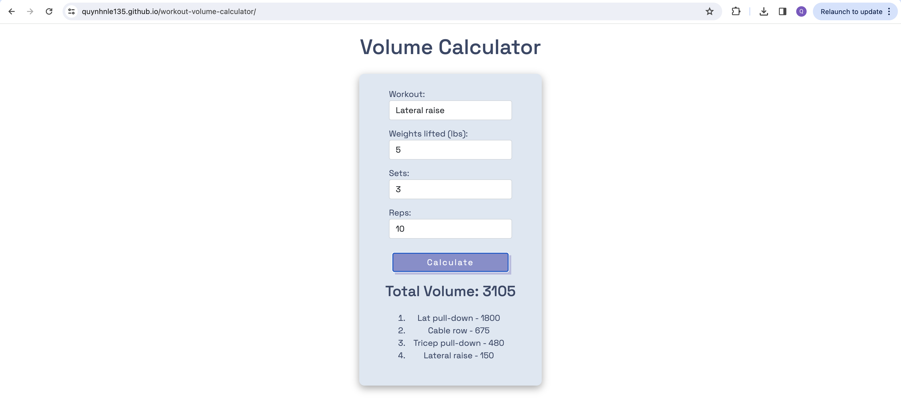

# Work-out Volume Calculator

- Simple web application to help you calculate volume of your work-out exercises in one session.
- Built with HTML, CSS, Bootstrap5, and JavaScript
- You can use this calculator [here](https://quynhnle135.github.io/workout-volume-calculator/)

# Screenshots of the Calculator

